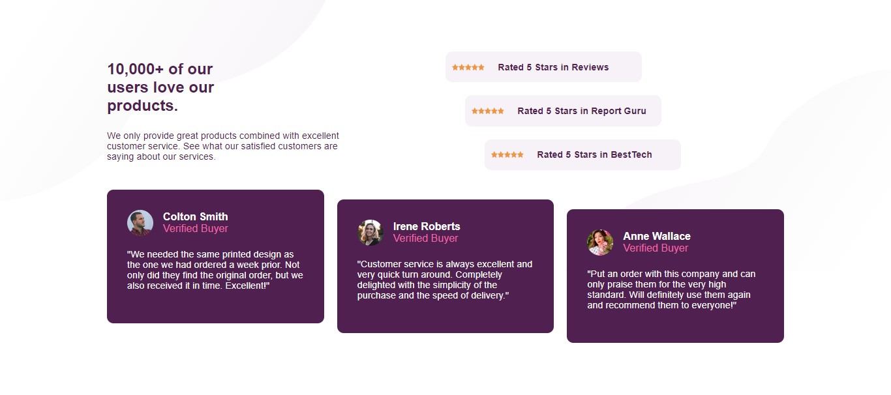

# Frontend Mentor - Social proof section solution

This is a solution to the [Social proof section challenge on Frontend Mentor](https://www.frontendmentor.io/challenges/social-proof-section-6e0qTv_bA). Frontend Mentor challenges help you improve your coding skills by building realistic projects. 

## Table of contents

- [Overview](#overview)
  - [The challenge](#the-challenge)
  - [Screenshot](#screenshot)
  - [Links](#links)
- [Author](#author)
## Overview

### The challenge

Users should be able to:

- View the optimal layout for the section depending on their device's screen size

### Screenshot

### Links

- Solution URL: [Click here](https://www.frontendmentor.io/solutions/social-proof-section-frontend-mentor-COE5Q-dH0t)
- Live Site URL: [Click here](https://your-live-site-url.com](https://arjuno-008.github.io/Social-proof-section-Frontend-Mentor/ )

## Author
- Frontend Mentor - [@ArjunO-008](https://www.frontendmentor.io/profile/ArjunO-008)

